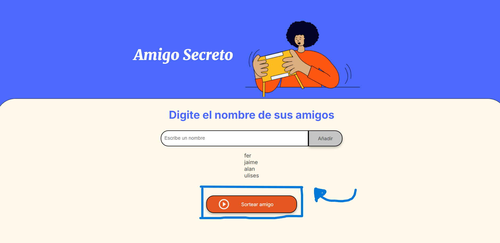

<h1 align="center">Primer challenge: amigo secreto</h1>

Este proyecto es el primer challenge de la ruta de aprendizaje del curso de Alura Latam en la sección de lógica de programación con JavaScript, el cual consiste en un pequeño sorteo de una lista de amigos que ingresa el usuario previamente.

<h2>¿Cómo funciona?</h2>
<h3>Añadir amigos</h3>

Primero, el usuario deberá de ingresar dentro del campo de texto (input) el nombre de tantos amigos desee añadir al sorteo, tras escribir el nombre de un amigo deberá de dar click en el botón "Añadir", con el cual se añadirá el nombre del amigo a una lista. 

<h3>Iniciar el sorteo</h3>

Tras añadir a los amigos deseados, deberá de dar click en el botón "Sortear Amigo" para que se elija (aleatoriamente) uno de los amigos que se añadieron a la lista. 

Después, aparecerá el amigo sorteado debajo del campo donde se ingresan los nombres.

<h3>Reinicio del sorteo</h3>

Luego de realizar el sorteo, el sistema automáticamente se reiniciará e iniciará de 0, por lo que deberás de ingresar los nombres de tus amigos nuevamente en caso de querer sortearlos otra vez.

¡Que disfrutes de este juego!

